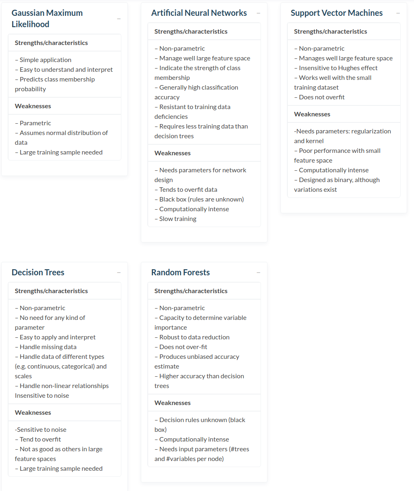

# remote sensing

# MSI

## classification

### segmentation

useful algorythms for segmation:
* Watershed algorithm
* Region growing algorithm

### feature extraction

feature categories
* Radiometric 
* temporal
* object features 

### unsupervised classification

* k-means
* isodata

### supervised classification

# SAR

Radarrückstreuung wird beinflusst durch:
* Bodenparameter
    * geometrische Eigenschaften
        * Oberflächenrauigkeit
        * Topographie
        * Objektgeometrie
        * Objektaisrichtung
    * dielektrische Eigenschaften (Wassergehalt)
* Sensorparameter
    * Wellenlänge & Frequenz
    * Polarisation
    * Zellgröße
    * Sensorgeometrie (Einfallswinkel, etc)
